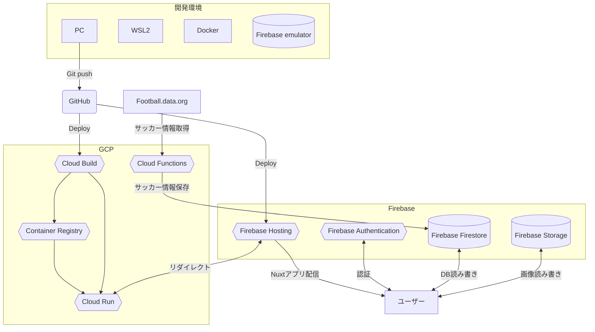

# フットレポ
サッカーの選手採点を投稿しTwitterで記事をシェアできるサービスです。

 

## リンク

<s>https://foot-repo.com/</s>

サーバー代やAPI代で赤字なので現在サービスを停止しました。

 

## 使用技術一覧
Nuxt.js, Typescript, Vuetify, Firebase, Cloud Run, Docker, Github actions

 

## アーキテクチャ

 

## 主な機能
- サインイン・サインアウト
- 記事作成・編集・削除
- 記事いいね
- 記事コメント
- ユーザーフォロー
